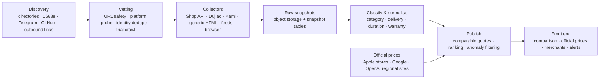

# PriceAI · Price Intelligence for AI Subscriptions

[简体中文](./README.md) · **English**

> Continuously collects real listed prices from public channels, normalises scattered listings into
> **comparable** entitlement products, and keeps the source, timestamp, stock and risk facts attached.
> The goal is not "one cheapest number" — it is that every quote can be traced and re-checked.

Live site: <https://priceai.io>

---

## What this is

There are too many ways to buy an AI subscription: the vendor's own site, regional app stores,
top-ups on your own account, pre-made accounts, shared accounts, redeem codes, API credit, reverse
proxies. The same "ChatGPT Plus" can differ tenfold across delivery methods, and **comparing them in
one bucket is meaningless**.

PriceAI does three things:

1. **Route first, compare second** — establish which purchase path you actually want, then compare within that spec.
2. **Anchor to the official price** — official listings across 174 regions act as the reference for every third-party quote.
3. **Keep every number checkable** — price, stock, verification time, original source and official evidence are all retained.

## Current scale

> As of 2026-09-14; changes continuously as collection runs.

| Metric | Count |
| --- | --- |
| Verified quotes | 10,896 |
| Active sources | 583 |
| Merchants | 630 |
| Confirmed in stock | 7,131 |
| Normalised spec groups | 27 |
| Official plan catalogue | 13 |
| Regions covered | 174 |

## Capabilities

**Reseller comparison** `/channels`
- 10 categories: ChatGPT, Claude, Gemini, Grok, video generation, design & office, domestic models, mailboxes, SMS verification, other
- 10 delivery methods kept distinct: API credit, top-up on your own account, pre-made account, redeem code, team seat, shared account, web mirror, reverse proxy, short-term trial, undetermined
- 5 warranty tiers: full subscription period, fixed hours, first login only, none, undetermined
- Filter by duration, currency, stock and warranty, with the ranking rules published

**Official subscription prices** `/official-prices`
- Public listed prices from Apple's regional stores, Google, and OpenAI's regional sites
- A 13-plan × 174-region matrix with a permanently pinned "official floor" column on the right
- CNY conversions carry the exchange-rate date and source; annual plans can be shown as a monthly equivalent
- Amounts whose billing period is unverified never take part in the lowest-price marker

**Autonomous source discovery and vetting**
- Candidates found from public shop directories, the 16688 wholesale board, public Telegram channels, GitHub topic pages, and outbound links inside already-collected catalogues
- Each candidate must pass URL safety checks, platform probing, identity de-duplication, a full trial crawl, AI-relevance scoring and mirror/outlier price detection
- Auto-approve, reject, or escalate to a human — and human decisions are never overwritten by automation

**Quality and anomalies**
- Outlier and mirror-site detection; anomalies are excluded from the lowest price
- Source health, crawl success rates and growth reporting
- Admin console covering sources, anomalies, reviews, reports, announcements, sponsorships and run records

**Other surfaces**: merchant views, brand pages, API transit comparison, official API pricing, change log,
price alerts, methodology and guides, plus Google / GitHub sign-in.

## Architecture



**Stack**: Next.js 16 (App Router / RSC / streaming), React 19, TypeScript strict,
PostgreSQL 17 + Drizzle ORM, BullMQ 6 + Redis 7, MinIO (S3-compatible), Playwright, pino, Zod 4.

## Workspaces

npm workspaces — 3 apps and 17 packages.

### Apps

| Path | Responsibility |
| --- | --- |
| `apps/web` | Next.js front end, admin console and API routes |
| `apps/worker` | Crawl scheduling, publishing, official prices, the long-running channel worker, and the ops CLI |
| `apps/browser-worker` | Isolated, low-concurrency Playwright worker |

### Packages

| Package | Responsibility |
| --- | --- |
| `schema` | Shared domain types and validation (offer / source / collector) |
| `database` | PostgreSQL + Drizzle schema, client and migrations (25 migrations) |
| `pipeline` | Orchestration: discovery, vetting, catalogue, publishing, quality, alerts, growth (25 modules) |
| `classifier` | Product classification and attribute extraction |
| `ranking` | Quote eligibility and ranking rules |
| `price-channels` | Official plan catalogue, regional storefront catalogues and parsers, exchange rates, official API and transit |
| `collector-sdk` | Shared collector interface, registry and same-origin rate limiting |
| `shop-api-collector` | Shop API collection for card-shop platforms |
| `shop-api-16688-collector` | 16688 storefront API collection |
| `dujiao-collector` | Dujiaoshuka site collection |
| `kami-collector` | Kami site collection |
| `generic-html-collector` | Generic HTML product extraction |
| `json-feed-collector` | Custom JSON and direct merchant feeds |
| `browser-collector` | Playwright document fetching |
| `source-signatures` | Card-system fingerprinting and platform-family shop identity |
| `anomaly-detector` | Quote outlier and anomaly detection |
| `object-storage` | Raw snapshot object storage (S3 / MinIO) |

## Quick start

Requires Node >= 20.9, npm >= 10, and Docker.

```bash
cp .env.example .env          # 61 variables; the core path needs no external keys
docker compose up -d          # postgres:17 · redis:7 · minio
npm install
npm run db:generate
npm run db:migrate
npm run dev                   # web → http://localhost:3000

# in separate terminals
npm run dev:worker
npm run dev:browser-worker
```

The Grok, search, notification and LLM keys in `.env` are optional; leaving them unset does not affect
the core comparison and publishing path.

## Commands

### Workspace scripts

| Command | Purpose |
| --- | --- |
| `npm run dev` / `dev:worker` / `dev:browser-worker` | Start each app |
| `npm run typecheck` | Type-check every workspace |
| `npm run test` | Test every workspace |
| `npm run build` | Build every workspace |
| `npm run db:generate` / `db:migrate` / `db:studio` | Drizzle migrations and studio |

### Worker CLI

```bash
npm run cli --workspace @price-radar/worker -- <command> [args]
```

| Group | Commands |
| --- | --- |
| Crawl & publish | `probe <url>` · `onboard <url>` · `crawl <source-id>` · `publish` · `rollback` · `refresh-channels` · `channel-cycle` · `snapshot-generation` |
| Official prices | `refresh-subscriptions [featured]` · `refresh-official-api` · `refresh-transit` |
| Discovery | `discover-links` · `discover-telegram` · `discover-github` · `discover-search` · `discover-grok` · `import-directories` · `enumerate-16688 [all]` · `llm-extract-candidates` |
| Vetting & quality | `vet-candidates` · `precheck-submission <id>` · `refresh-quality-profiles` · `coverage-check` · `repair-entry-urls` |
| Alerts & ops | `evaluate-alerts` · `deliver-notifications` · `growth-report` · `recover-growth` · `recover-classifier` · `retire-utility-hosts` · `bootstrap` |

Long-running processes: `npm run start:channels --workspace @price-radar/worker` (reseller collection) and
`npm run start:official --workspace @price-radar/worker` (official subscription prices).

## Comparison rules

These are product-level constraints — read [PRODUCT.md](./PRODUCT.md) before changing them:

1. **Compare like with like** — delivery method, duration, account ownership and warranty must be visible and filterable; different delivery methods never merge into one "lowest price".
2. **Every number stays checkable** — price, stock, update time, source and official evidence remain traceable.
3. **Facts, not endorsements** — state the risks, data freshness and transaction boundaries rather than vouching for any seller.
4. **Anomalies and stale data are excluded** — outliers, mirror sites and amounts with an unverified billing period never enter the lowest price.
5. **Accessibility** — WCAG 2.1 AA as the target; keyboard support for key actions, and colour is never the only carrier of state.

## Development notes

- **Classification is written at publish time**: changing `packages/classifier` does not require re-crawling — run `publish` to reclassify the latest snapshots.
- **A/B any classifier rule change**: replay production inputs (include `raw_description`) through old and new rules before shipping.
- **Migrations**: `drizzle-kit generate` needs `DATABASE_URL` set; files land in `packages/database/drizzle/`.
- **Before committing**: run at least `npm run typecheck` and the relevant workspace's `npm run test`.
- **CI**: `.github/workflows/production.yml` (*Check and deploy PriceAI*) runs tests and a production build on push and PR, then promotes the release and verifies the live pages and version fingerprint.

## Deployment and operations

Production deployment, daily official collection and scheduling are governed by the
[Dokploy runbook](./docs/operations/dokploy.md); security roles, backups and restore drills are in the
[operations runbook](./docs/operations/security-and-recovery.md).
Web and collection services deploy independently, and official-subscription scheduling does not depend
on an external cron endpoint.

> Server addresses, SSH credentials and environment backups are deliberately not in this repository.

## Documentation map

| Document | Contents |
| --- | --- |
| [Plan index](./docs/plans/README.md) | PRD, architecture, data model and feature inventory |
| [Feature acceptance matrix](./docs/implementation/feature-acceptance.md) | Per-item evidence for 125 features (3 require external service keys) |
| [Implementation status](./docs/implementation/status.md) | Phase progress and production acceptance boundaries |
| [Source discovery and vetting](./docs/implementation/source-vetting.md) | Candidate discovery, vetting decisions and the human-review boundary |
| [Official price collection](./docs/research/official-price-collection-automation-2026-09-07.md) | Collection rules and evidence requirements for official prices |
| `docs/research/` | 22 research and measurement records |

## Licence

Private repository with no open-source licence attached; not for redistribution or reuse without permission.
