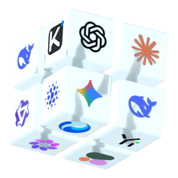
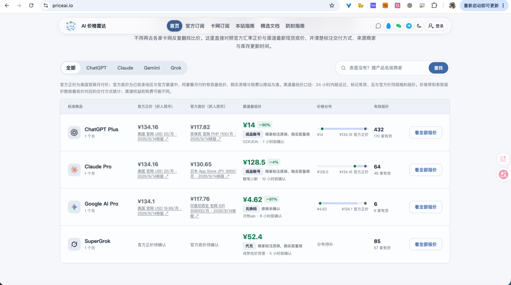
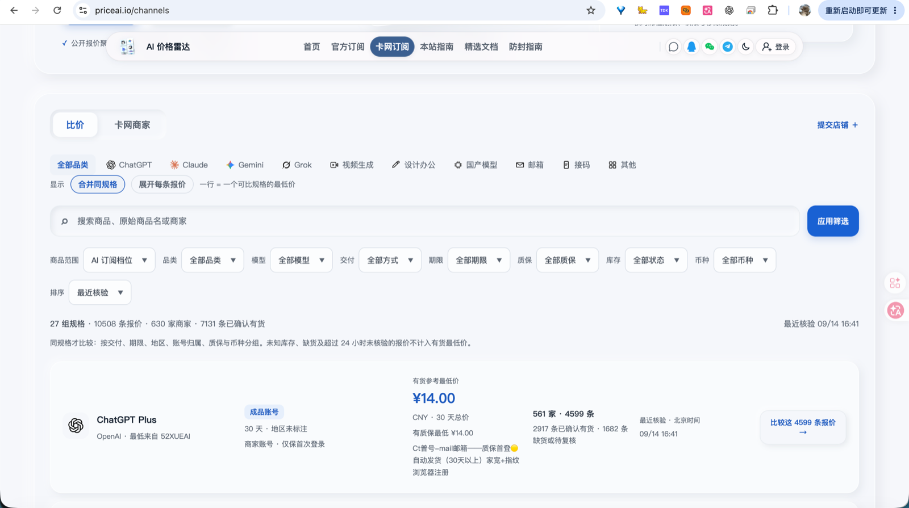
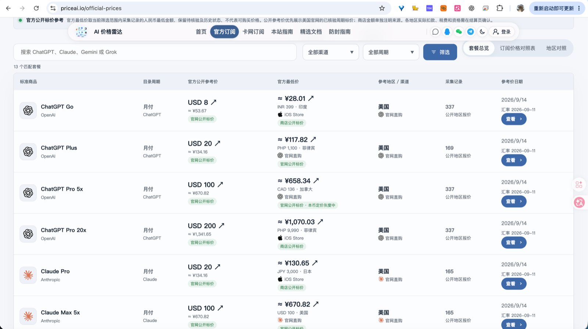
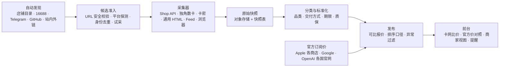

<p align="center">
  
</p>

<h1 align="center">PriceAI——AI底价比价雷达</h1>

<p align="center">
  <strong>持续采集公开渠道的真实售价，把零散商品标准化成可比较的权益产品。</strong><br/>
  官方价作基准，渠道报价按交付方式、期限与质保分组；目标不是"找到最便宜的一个数字"，<br/>
  而是让每一条报价都保留来源、时间、库存与风险事实，能被追溯和复核。
</p>

<p align="center">
  <a href="https://priceai.io">在线访问</a> ·
  <strong>简体中文</strong> ·
  <a href="./README.en.md">English</a>
</p>



*AI 底价一目了然：官方正价、官方底价与渠道最低价并排对照，交付方式、来源商家与核验时间一并标注。*

---

## 这是什么

市面上买 AI 订阅有太多条路径：官网直购、各国商店、代充、成品账号、共享号、兑换码、API 额度、反代……
同一个 "ChatGPT Plus"，不同交付方式的价格可以差十倍，**混在一起比价是没有意义的**。

PriceAI 做三件事：

1. **先分流，再比价** —— 先确认你要的是哪种购买路径，再在同规格内比较。
2. **把官方价钉成基准** —— 174 个地区的官方标价与折算，作为一切第三方报价的参照系。
3. **每个数字都能回看** —— 价格、库存、核验时间、原始来源、官方证据全部保留可查。

## 当前规模

> 数据截至 2026-09-14，随采集持续变化。

| 指标 | 数量 |
| --- | --- |
| 已验证报价 | 10,896 条 |
| 活跃来源 | 583 个 |
| 收录商家 | 630 家 |
| 已确认有货 | 7,131 条 |
| 标准化规格组 | 27 组 |
| 官方套餐目录 | 13 个 |
| 覆盖地区 | 174 个 |

## 核心能力

**卡网比价** `/channels`
- 10 个品类分流：ChatGPT、Claude、Gemini、Grok、视频生成、设计办公、国产模型、邮箱、接码、其他
- 10 种交付方式区分：API 额度、自己账号代充、成品账号、兑换码/卡密、团队席位、共享账号、网页镜像、反代服务、短期体验、交付待确认
- 5 档质保口径：订阅期质保、固定时长质保、仅保首次登录、无质保、质保待确认
- 按期限、币种、库存、质保筛选，排序口径公开



*卡网订阅底价：同规格才比较——按交付、期限、地区、账号归属、质保与币种分组；未知库存、缺货及超过 24 小时未核验的报价不计入有货最低价。*

**官方订阅价对照** `/official-prices`
- Apple 各国商店、Google、OpenAI 各国官网的公开标价
- 13 个目录套餐 × 174 个地区的横向对照表，右侧常驻「官方底价」列
- 人民币折算标注汇率日期与来源；年付可切换「每月折算」口径
- 周期未经证实的金额不参与最低价标记



*官方订阅底价：13 个目录套餐的官方公开参考价与跨地区折算最低价，标注参考地区、购买渠道、采集记录数与汇率日期。*

**来源自动发现与准入**
- 从公开店铺目录、16688 货源广场、Telegram 公开频道、GitHub 主题页及已采目录中的外链发现候选
- 候选须通过 URL 安全校验、平台探测、身份去重、完整试采、AI 相关度与镜像/异常价检测
- 自动启用 / 拒绝 / 转人工，人工审核结果不会被自动决策覆盖

**质量与异常**
- 报价离群与镜像站检测，异常不参与最低价
- 来源健康度、采集成功率与增长报告
- 管理后台覆盖来源、异常、审核、举报、公告、赞助与运行记录

**其他前台能力**：商家视图、品牌页、API 中转对照、官方 API 价、变更记录、订阅提醒、方法论与指南，以及 Google / GitHub 登录。

## 架构



**技术栈**：Next.js 16（App Router / RSC / 流式渲染）、React 19、TypeScript strict、
PostgreSQL 17 + Drizzle ORM、BullMQ 6 + Redis 7、MinIO（S3 兼容）、Playwright、pino、Zod 4。

## 工作区

npm workspaces，3 个应用 + 17 个包。

### 应用

| 目录 | 职责 |
| --- | --- |
| `apps/web` | Next.js 前台、管理后台与 API 路由 |
| `apps/worker` | 采集调度、发布、官方价与 Channel 常驻 Worker，以及运维 CLI |
| `apps/browser-worker` | 隔离、低并发的 Playwright Worker |

### 包

| 包 | 职责 |
| --- | --- |
| `schema` | 共享领域类型与校验（offer / source / collector） |
| `database` | PostgreSQL + Drizzle Schema、客户端与迁移（25 个迁移） |
| `pipeline` | 业务编排：发现、准入、目录、发布、质量、告警、增长（25 个模块） |
| `classifier` | 商品分类与属性抽取 |
| `ranking` | 报价可用性判定与排序口径 |
| `price-channels` | 官方订阅目录、各国商店目录与解析、汇率、官方 API 与中转 |
| `collector-sdk` | 采集器公共接口、注册表与同源限速 |
| `shop-api-collector` | 发卡平台 Shop API 采集 |
| `shop-api-16688-collector` | 16688 店铺接口采集 |
| `dujiao-collector` | 独角数卡站点采集 |
| `kami-collector` | 卡密站点采集 |
| `generic-html-collector` | 通用 HTML 商品抽取 |
| `json-feed-collector` | 自定义 JSON 与商家直连 Feed |
| `browser-collector` | Playwright 文档抓取 |
| `source-signatures` | 发卡系统指纹与平台族店铺身份识别 |
| `anomaly-detector` | 报价离群与异常检测 |
| `object-storage` | 原始快照对象存储（S3 / MinIO） |

## 快速开始

需要 Node >= 20.9、npm >= 10、Docker。

```bash
cp .env.example .env          # 61 个变量，核心链路无需外部密钥
docker compose up -d          # postgres:17 · redis:7 · minio
npm install
npm run db:generate
npm run db:migrate
npm run dev                   # Web → http://localhost:3000

# 另开终端
npm run dev:worker
npm run dev:browser-worker
```

`.env` 中的 Grok、搜索、通知与 LLM 密钥是可选的；不配置不影响核心比价与发布链路。

## 常用命令

### 工作区脚本

| 命令 | 作用 |
| --- | --- |
| `npm run dev` / `dev:worker` / `dev:browser-worker` | 分别启动三个应用 |
| `npm run typecheck` | 全工作区类型检查 |
| `npm run test` | 全工作区测试 |
| `npm run build` | 全工作区构建 |
| `npm run db:generate` / `db:migrate` / `db:studio` | Drizzle 迁移与可视化 |

### Worker CLI

```bash
npm run cli --workspace @price-radar/worker -- <命令> [参数]
```

| 分组 | 命令 |
| --- | --- |
| 采集与发布 | `probe <url>` · `onboard <url>` · `crawl <source-id>` · `publish` · `rollback` · `refresh-channels` · `channel-cycle` · `snapshot-generation` |
| 官方价 | `refresh-subscriptions [featured]` · `refresh-official-api` · `refresh-transit` |
| 来源发现 | `discover-links` · `discover-telegram` · `discover-github` · `discover-search` · `discover-grok` · `import-directories` · `enumerate-16688 [all]` · `llm-extract-candidates` |
| 准入与质量 | `vet-candidates` · `precheck-submission <id>` · `refresh-quality-profiles` · `coverage-check` · `repair-entry-urls` |
| 告警与运营 | `evaluate-alerts` · `deliver-notifications` · `growth-report` · `recover-growth` · `recover-classifier` · `retire-utility-hosts` · `bootstrap` |

常驻进程：`npm run start:channels --workspace @price-radar/worker`（卡网采集）、
`npm run start:official --workspace @price-radar/worker`（官方订阅价）。

## 比价口径

这些是产品的硬约束，改动前请先读 [PRODUCT.md](./PRODUCT.md)：

1. **同规格才比较** —— 交付方式、期限、账号归属、质保必须可见且可筛选，不同交付方式不混成同一个"最低价"。
2. **每个数字都能回看** —— 价格、库存、更新时间、来源与官方证据保持可追溯。
3. **展示事实而非背书** —— 明确风险、数据新鲜度与交易边界，不给渠道站台。
4. **异常与过期不参与最低价** —— 离群价、镜像站、周期未证实的金额一律排除在最低价之外。
5. **无障碍** —— 以 WCAG 2.1 AA 为目标；关键操作支持键盘，颜色不是状态的唯一载体。

## 开发约定

- **分类在发布时写入**：改了 `packages/classifier` 不需要重新采集，跑一次 `publish` 即可对最新快照重算分类。
- **改分类规则先做 A/B 对照**：用生产输入（务必带 `raw_description`）跑新旧规则比对，再决定是否上线。
- **迁移**：`drizzle-kit generate` 需要设置 `DATABASE_URL`；迁移文件落在 `packages/database/drizzle/`。
- **提交前**：至少跑 `npm run typecheck` 与相关工作区的 `npm run test`。
- **CI**：`.github/workflows/production.yml`（*Check and deploy PriceAI*）在 push / PR 上运行测试与生产构建，通过后推进发布并校验线上页面与版本指纹。

## 部署与运维

生产部署、每日官方采集与调度以 [Dokploy 运行手册](./docs/operations/dokploy.md) 为准；
安全角色、备份与恢复演练见 [运行手册](./docs/operations/security-and-recovery.md)。
Web 与采集服务独立部署，官方订阅调度不依赖外部定时端点。

> 服务器地址、SSH 凭据与环境变量备份不写在本仓库，见本地运维文档。

## 文档地图

| 文档 | 内容 |
| --- | --- |
| [方案总索引](./docs/plans/README.md) | 产品 PRD、架构、数据模型与功能清单 |
| [功能验收矩阵](./docs/implementation/feature-acceptance.md) | 125 项功能逐项实施证据（其中 3 项需配置外部服务密钥） |
| [实施状态](./docs/implementation/status.md) | 阶段进度与生产验收边界 |
| [来源发现与自动检测](./docs/implementation/source-vetting.md) | 候选发现、准入判定与人工审核边界 |
| [官方订阅价采集方案](./docs/research/official-price-collection-automation-2026-09-07.md) | 官方价采集口径与证据要求 |
| `docs/research/` | 22 篇调研与实测记录 |

## 致敬

本项目的产品思路与信息结构，受到 [dimthink/PriceAI](https://github.com/dimthink/PriceAI)（priceai.cc）的影响——是它先把"卡网渠道的报价值得被系统地比较、并以官方价作基准"这件事做了出来，也影响了我们对同规格分组与来源可追溯的理解。在此致谢。

需要说清楚的边界：本仓库不包含该项目的代码，不引用其站点资源；采集来源、比价口径与实现路径各自独立。

## 许可

私有仓库，未附开源许可证；未经授权不得分发或复用。
